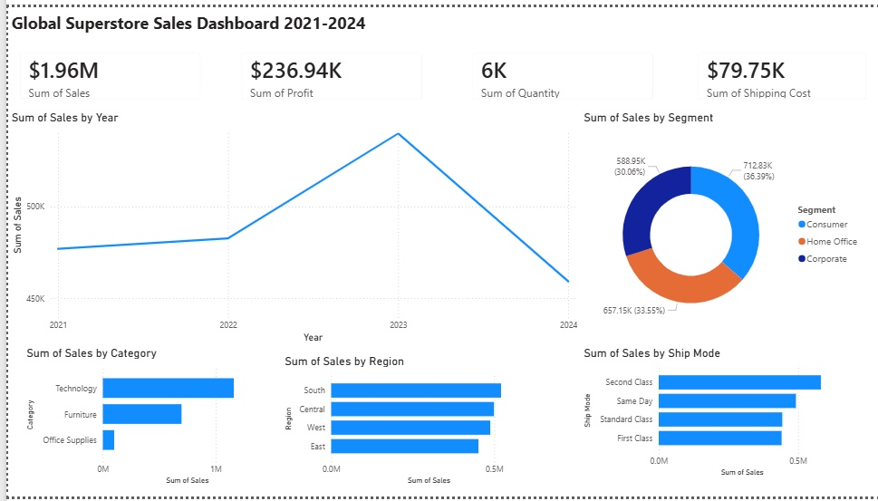

# 📊 Power BI – Global Superstore Sales Dashboard

A Power BI dashboard built using a simulated Global Superstore dataset (2021–2024). I created this project to explore how sales and profitability trends change across regions, customer segments, and shipping methods, and to practise building clean, single-page dashboards for business reporting.

---

## 📸 Dashboard Preview



---

## 📁 Project Structure

```
powerbi-superstore-project/
├── data/
│   └── superstore_2021_2024.csv        # Source dataset (1,978 rows, 800 orders)
├── dax/
│   └── measures.md                     # DAX measures reference
├── docs/
│   ├── data_dictionary.md              # Field definitions
│   ├── report_guide.md                 # How to use the report
│   └── dashboard_screenshot.png        # Dashboard preview image
├── Superstore_Dashboard.pbit           # Power BI Template file
└── README.md
```

---

## 📌 Dataset Overview

| Field | Description |
|---|---|
| Order ID | Unique order identifier |
| Order Date | Date order was placed |
| Ship Date | Date order was shipped |
| Ship Mode | Shipping method (First Class, Second Class, Standard Class, Same Day) |
| Customer ID / Name | Customer identifiers |
| Segment | Consumer, Corporate, or Home Office |
| Region / State / City | US geographic hierarchy |
| Category / Sub-Category | Product classification |
| Product Name | Product description |
| Sales | Total sales value ($) |
| Quantity | Units ordered |
| Discount | Discount applied (0–40%) |
| Profit | Net profit after cost and discount |
| Shipping Cost | Shipping fee charged |

**Source:** Simulated dataset modelled on the [Kaggle Global Superstore dataset](https://www.kaggle.com/datasets/vivek468/superstore-dataset-final), 2021–2024.

---

## 📊 Dashboard Overview

The report is a single-page dashboard containing the following visuals:

### KPI Cards
| Card | Value |
|---|---|
| Total Sales | $1.96M |
| Total Profit | $236.94K |
| Total Quantity | 6K units |
| Total Shipping Cost | $79.75K |

### Visuals
- **Sales Trend 2021–2024** — Line chart showing annual sales performance over four years
- **Sales by Segment** — Donut chart breaking down revenue across Consumer (36.39%), Home Office (33.55%), and Corporate (30.06%)
- **Sales by Category** — Horizontal bar chart comparing Technology, Furniture, and Office Supplies
- **Sales by Region** — Horizontal bar chart comparing South, Central, West, and East regions
- **Sales by Ship Mode** — Horizontal bar chart comparing Second Class, Same Day, Standard Class, and First Class shipping

---

## 🚀 How to Use

### Option A – Use the Template (.pbit)
1. Open `Superstore_Dashboard.pbit` in Power BI Desktop (Windows)
2. When prompted for the data source path, navigate to `data/superstore_2021_2024.csv`
3. Click **Load** — all measures and data will populate
4. Rebuild the visuals using the layout shown in the screenshot above

### Option B – Power BI Service (Web)
1. Go to [app.powerbi.com](https://app.powerbi.com)
2. Create a new report and upload `data/superstore_2021_2024.csv` via Get Data
3. Recreate the visuals as shown in the dashboard screenshot

---

## 🛠 Tools & Technologies

- **Power BI Service** — report authoring and dashboard design
- **DAX** — calculated measures and KPIs (see `dax/measures.md`)
- **Power Query (M)** — data transformation
- **Python** — dataset generation

---

  ## 🔍 Key Insights

- The Consumer segment generates the highest revenue, but profit margins vary across categories
- Technology leads in sales, while Furniture shows more variability in profitability
- Standard Class shipping dominates order volume, suggesting cost–speed trade-offs

---

## 📈 Skills Demonstrated

- Data visualisation and dashboard design in Power BI
- KPI reporting (Sales, Profit, Quantity, Shipping Cost)
- Segment, regional, and category analysis
- Data storytelling through a clean single-page layout

---

## 👤 Author

**Dion** | Bachelor of Business Analytics, Deakin University

---

## 📄 Licence

This project is open source under the MIT Licence.
